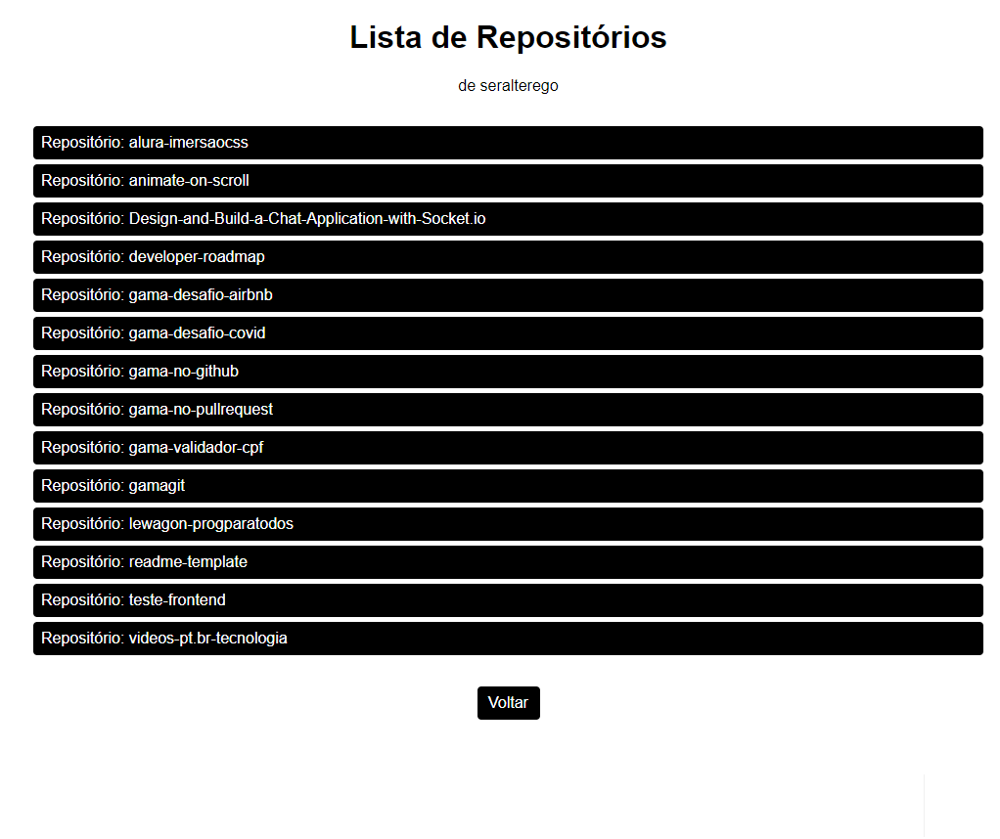

# GamaGit

> Aplicação simples para consulta de repositórios do GitHub utilizando React e seus recursos básicos.

Projeto feito com base nas aulas do módulo de React da Gama Academy em 2020.

## :rocket: Usabilidade e Screenshots

- Digita-se o nome do usuário do GitHub:<br>
  

- Após a pesquisa, o resultado é a lista de repositórios do usuário pesquisado:<br>


## :wrench: Configuração para Desenvolvimento

> This project was bootstrapped with [Create React App](https://github.com/facebook/create-react-app).

Para rodar o projeto:

```sh
yarn ou npm start
```

Depois acesse depois <http://localhost:3000/> 

---

## :email: Contato

Twitter: [@seralterego](https://twitter.com/seralterego)
:email: sergiomiranda86@gmail.com

<!-- Distribuído sob a licença FREE. Veja `LICENSE` para mais informações. -->

[https://github.com/seralterego/](https://github.com/seralterego/)

## :wink: Contribua aí

1. Faça o _fork_ do projeto (<https://github.com/seralterego/gamagit/fork>)
2. Crie uma _branch_ para sua modificação (`git checkout -b feature/[modificação]`)
3. Faça o _commit_ (`git commit -am 'Adicionando modificação'`)
4. _Push_ (`git push origin feature/[modificação]`)
5. Crie um novo _Pull Request_

---

:link: **Link da aplicação:** <>
